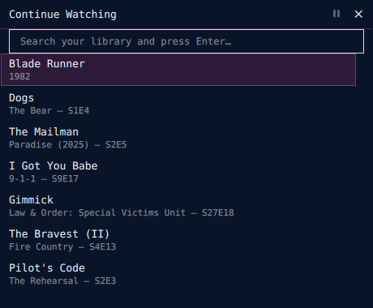
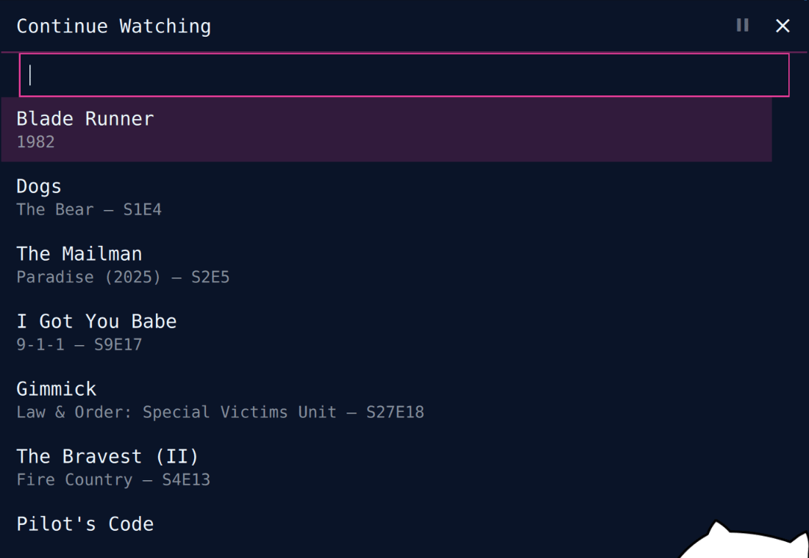

# Plex Mini for Omarchy

A floating, resizable Plex miniplayer for Omarchy. Open it and type immediately to search your library, or pick from Continue Watching. Video plays inside the panel by default, with resume, seek, pause, stop, scrobbling, and transcode fallback.





## Install

Install **Plex Mini** from Omarchy Plugin Control or use the command shown on its marketplace page.

## Remove

Uninstall it from Plugin Control. For a complete reset:

```bash
rm -rf ~/.config/plexmini ~/.local/state/plexmini
```

## Requirements

- Omarchy Quattro / Quickshell
- `curl` (included with Omarchy)
- Plex server URL and `X-Plex-Token`
- Optional mpv backend: `mpv` and `socat`

The default `internal` backend renders inside the panel via QtMultimedia. Set `"backend": "mpv"` only when you explicitly want a separate dGPU-backed mpv window.

## Setup

Open Plex Mini and enter:

1. Your server origin, e.g. `http://192.168.1.50:32400`
2. An `X-Plex-Token` — follow Plex's official guide: [Finding an authentication token / X-Plex-Token](https://support.plex.tv/articles/204059436-finding-an-authentication-token-x-plex-token/)

The linked article is maintained by Plex and documents the supported web-app XML method, including where the token appears.

Credentials are validated and stored at `~/.config/plexmini/config.json` with mode `0600` inside a `0700` directory.

```json
{ "server": "http://192.168.1.50:32400", "token": "YOUR_TOKEN", "backend": "internal" }
```

## Interaction

- Start typing immediately: live search runs after a 300 ms debounce
- `Up` / `Down`: select result
- `PgUp` / `PgDn`: move eight results
- `Enter`: play selection
- `Space`: pause / resume
- `Left` / `Right`: seek 30 seconds
- `M`: mute internal playback
- `Esc` or close: pause, then hide
- Drag header: move panel
- Drag top-left grip: resize (280–900 px), persisted

During playback the selector collapses; only video and controls remain. Direct play resumes from Plex's `viewOffset`; progress reports every 10 seconds and scrobbles at 90%. Unsupported media retries through Plex universal-transcode HLS.

## Scope

No transcode-quality settings UI, no subtitle selection, no multi-server support. Library access is Continue Watching plus search.

## Security and limits

- API token travels in headers; API requests do not follow redirects
- Config is strict-shape validated, read only from a bounded no-follow, nonblocking file descriptor, and atomically written chmod `0600` (destination symlinks are replaced, not followed)
- Remote part paths must remain absolute Plex library paths
- Remote titles render as `Text.PlainText`
- mpv runs `--no-config --no-ytdl` with a randomized IPC socket
- API response buffering is capped: 4 MiB list/search, 2 MiB metadata
- Model mapping caps responses to 256 items and 256-character display fields

Residual media-leg risk: mpv requires its token header in process arguments. The default internal backend avoids argv exposure but QtMultimedia cannot set request headers, so its direct-play/transcode token rides in the media URL query and redirect handling is player-controlled. API requests themselves remain header-only and non-redirecting.

## Tests

```bash
node --test tests/*.test.mjs
```

The suite covers validation, bounded response mapping, grouped search results, playback metadata and resume extraction, time formatting, plus static integration contracts for buffering caps, sticky resume, pause-on-close, live search, and keyboard focus.

## License

MIT — see [LICENSE](LICENSE).
