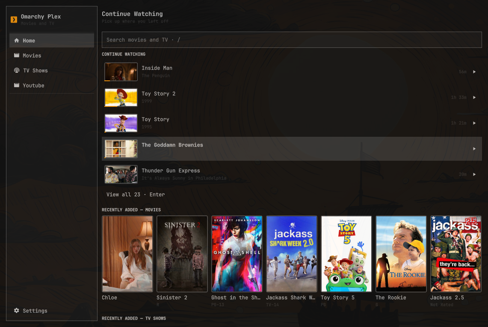
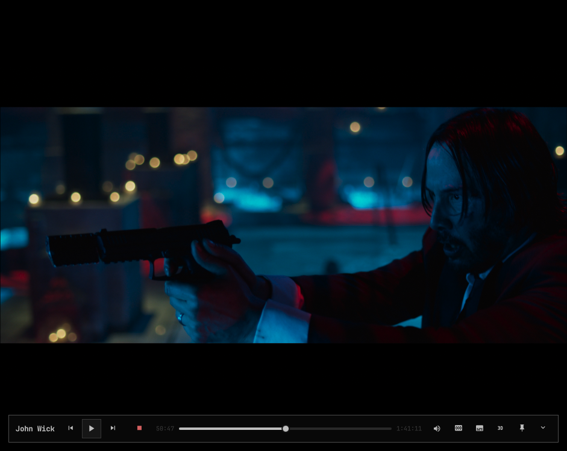
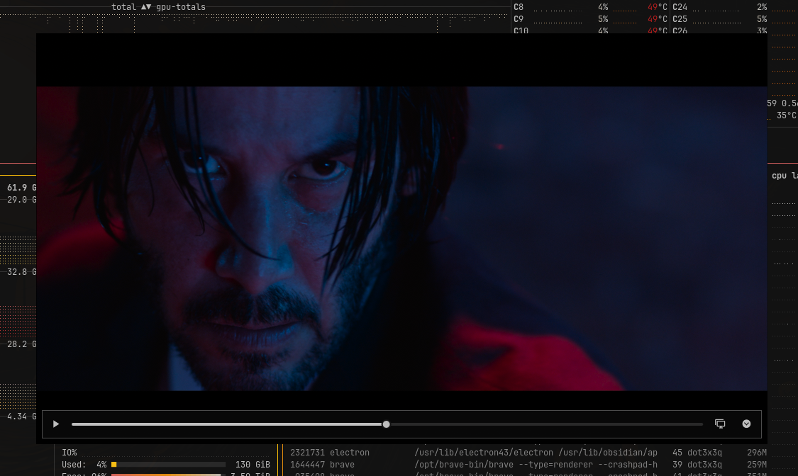
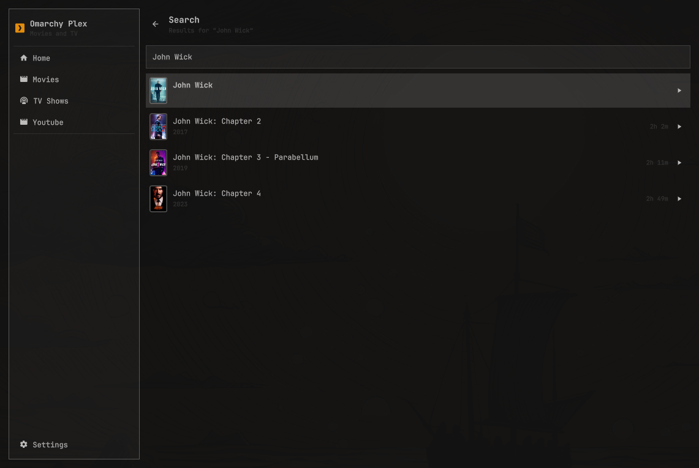
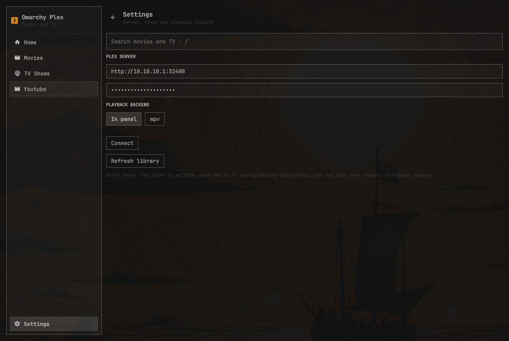

# omarchy-plex

A Plex media player for [Omarchy](https://omarchy.org). Real window in the
tiling tree, library browsing, poster grids, a proper theater view, and a
picture-in-picture mode that can be resized and plopped on additional monitors.

I wanted a Plex player that was lightweight, performant, and true to the
Omarchy theme, so I built this player exactly as I wanted it. Use it, tweak it, and upgrade it as you like!



<p align="center">
  
  
</p>
<p align="center">
  
  
</p>

## What you get

- **Media Browser** — Home page with Continue Watching and
  Recently Added shelves, a sidebar entry per video library, poster grids,
  and detail pages with backdrop art, synopsis, and season/episode
  drill-down. Movies and TV only; your music stays in your music player.
- **Search everything** — `/` from anywhere, whole server, results as you
  type.
- **Theater + minibar** — video fills the window with controls that get out
  of the way. Hit Esc and it keeps playing behind a now-playing bar while
  you browse for what's next.
- **PiP** — `p` pops the video into a corner card that floats above
  everything and is click-through everywhere else. Drag it anywhere (it
  shows you exactly where it'll land, even across monitors), snap it to
  corners, resize it, walk it across displays with `n`. Esc brings it home.
- **Real playback** — with the optional native module, video renders through
  libmpv: hardware decode, proper HDR tone mapping (your dark scenes will
  stop looking crushed), and image subtitles (PGS/VOBSUB) rendered natively
  instead of via server burn-in.
- **Tracks and quality** — `a`/`s`/`q` mid-playback for audio tracks,
  subtitles, and stream quality. Direct-play switches are instant; anything
  needing the server restarts at your position.
- **Volume to 200%** — for those movies mixed by people who hate you.
- **Keyboard-first** — arrows and `hjkl` drive one shared cursor; the whole
  app works without a mouse. Full reference below.
- **Bar widget** — the icon grows a scrolling now-playing title while
  something plays. Click toggles the window.
- Resume, progress sync, and scrobbling all work like you'd expect — Plex
  knows where you stopped, whatever client you open next.

## Install

```bash
git clone https://github.com/dot3x3q/omarchy-plex
ln -s "$(pwd)/omarchy-plex" ~/.config/omarchy/plugins/dot3x3q.omarchy-plex
omarchy restart shell
```

Then add the bar widget from Omarchy's bar settings, or just toggle the
panel directly:

```bash
omarchy-shell shell toggle dot3x3q.omarchy-plex
```

### The native video module (recommended)

Out of the box, video renders through QtMultimedia — works fine, zero extra
steps. But the good stuff (HDR tone mapping, NVDEC/VAAPI hardware decode,
native image subtitles) comes from a small compiled libmpv module:

```bash
./native/install.sh
omarchy restart shell
```

That's it — the plugin detects the module and upgrades itself. No module, no
problem: it falls back to QtMultimedia automatically, always. (This fallback
is permanent by design — the module is OpenGL-only, so a shell forced onto
the Vulkan scene graph would need it. See `native/README.md`.)

## Setup

First open drops you on a setup page:

1. **Server URL** — `http://your-server:32400`
2. **X-Plex-Token** — Plex's guide: [finding your
   token](https://support.plex.tv/articles/204059436-finding-an-authentication-token-x-plex-token/)
3. **Backend** — leave it on "In panel" unless you specifically want
   playback in an external mpv window

Config lands in `~/.config/omarchy-plex/config.json`, chmod 600, written
atomically. The token travels in request headers wherever technically
possible; the exceptions (image URLs, QtMultimedia media URLs — neither can
send headers) are documented in `docs/DESIGN.md`. The native module sends it
header-only, which is one more reason to build it.

## The two surfaces

**The window** is a real Hyprland toplevel — tile it, float it, fullscreen
it. Drag any bare part of it to move it; the edges resize. This is where
browsing lives.

**The PiP** is video only, on purpose. It floats above everything, ignores
your clicks everywhere except the card itself, and gets out of your way.
When you drag it toward another monitor it pins at the border and paints a
ghost outline where it'll drop — release and it's there, still playing.

### Keeping the window fully opaque

Omarchy's default window rules make every unfocused window slightly
translucent. For most apps that looks great; for a movie it doesn't.
Add this to `~/.config/hypr/hyprland.lua` to opt the player out (the
same idiom Omarchy's stock rules use for mpv-style PiP and qemu):

```lua
o.window({ class = "^org\\.quickshell$", title = ".*Omarchy Plex$" }, {
  tag = "-default-opacity",
  opacity = "1 1",
})
```

Match by title, not class alone: the window's class is `org.quickshell`,
shared with the entire shell. The leading `.*` is required — Hyprland
regexes must match the whole string, and during playback the title
becomes "<media> — Omarchy Plex", so a bare `Omarchy Plex$` silently
stops matching the moment something plays.


## Keyboard reference

One cursor, shared by mouse and keyboard. Everything below has a mouse
equivalent.

### Browsing

| Key | Action |
|---|---|
| `↑` `↓` `←` `→` / `h` `j` `k` `l` | Move the cursor |
| `Tab` / `Shift+Tab` | Cycle region (search → page → sidebar → minibar) |
| `/` | Focus search |
| `Enter` | Open / play / run search |
| `Esc` | Layered: clear search → leave field → exit theater → back → arm close → close |
| `Alt+Left` | Back |
| `PageUp` / `PageDown` | Page the view |
| `r` | Refresh |
| `p` | Toggle PiP |
| `Space` | Play/pause, globally, whenever something's playing |
| `m` | Mute, likewise |

### While playing (theater / PiP)

| Key | Action |
|---|---|
| `Space` / `Enter` | Play / pause |
| `←` / `→`, `Shift+←` / `Shift+→` | Seek 10s / 30s |
| `↑` / `↓` | Volume ±5 (0–200%) |
| `m` | Mute |
| `x` | Stop |
| `a` / `s` / `q` | Audio / subtitle / quality picker (window only) |
| `p` | Toggle PiP |
| `n` / `Shift+n` | Walk the PiP across monitors |
| `Esc` | PiP → window; theater → browse (keeps playing) |

### Pickers (once open)

`↑↓`/`jk` move, `Home`/`End` jump, `Enter` selects, `a`/`s`/`q` switch
lists, `Esc` closes.

## Hacking on it

- `docs/DESIGN.md` — the design spec: every decision and why.
- `docs/PLEX-API.md` — every Plex endpoint used, verified against a live
  server.
- `AGENTS.md` — dev-loop commands (lint, tests, the compile gate that
  catches what the linter can't).
- `node --test tests/*.test.mjs` — Api mappers, IO safety, and static
  contract pins over the QML.

## Removing

```bash
rm -rf ~/.config/omarchy-plex ~/.local/state/omarchy-plex
rm ~/.config/omarchy/plugins/dot3x3q.omarchy-plex
```

## Credit

This project started life as a fork of Joshua Warren's
[omarchy-plexmini](https://github.com/joshuaswarren/omarchy-plexmini), a
deliberately tiny bar-summoned miniplayer. It has since been rebuilt into
something else entirely, but the foundation — the Plex API plumbing and the
genuinely careful security posture around the token — is his work, and this
project wouldn't exist without it. Go star the original.

## License

MIT — see [LICENSE](LICENSE), which carries both copyrights.
